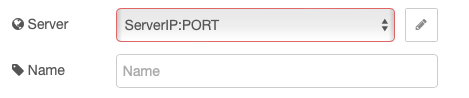
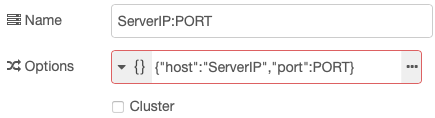

## Prerequisites
- Software:
    - Docker (Application containers engine)
    - HiveMq 
    - Node-RED
    - Redis

## Install Docker

You can install docker by following installing [guide](https://docs.docker.com/engine/install/).

## Install Hivemq

Install HiveMq with the following command:

```sh
docker run -p 8080:8080 -p 1883:1883 --name my-hive-mq  hivemq/hivemq4 
```

Now you can visit http://localhost:8080 for HiveMQ control pannel.

### Default credential:
- username: <b>admin</b>
- password: <b>hivemq</b>

## Install Node-RED
Install Node-Red with the following command:
```sh
docker run -it -p 1880:1880 --name my-node-red nodered/node-red  
```

Now you can visit http://localhost:1880 Node-RED UI.

## Install Redis
Install Redis with the following command:
```sh
docker run --name my-redis -p 6379:6379 -d redis
```
Redis default port is: <b>6379</b>

## Node-RED Library

### [node-red-contrib-redis](https://flows.nodered.org/node/node-red-contrib-redis)
```sh
npm install node-red-contrib-redis
```

### [node-red-node-email](https://flows.nodered.org/node/node-red-node-email)
```sh
npm install node-red-node-email
```

### [node-red-dashboard](https://flows.nodered.org/node/node-red-dashboard)
```sh
npm install node-red-dashboard
```

## Configure Redis Node

For configure connection in a Redis Node add

As server name write:<br>
**ServerIP:PORT**

<p align="center"></p>


In Option write
```js
{"host":"ServerIP","port":PORT}
```
<p align="center"></p>
